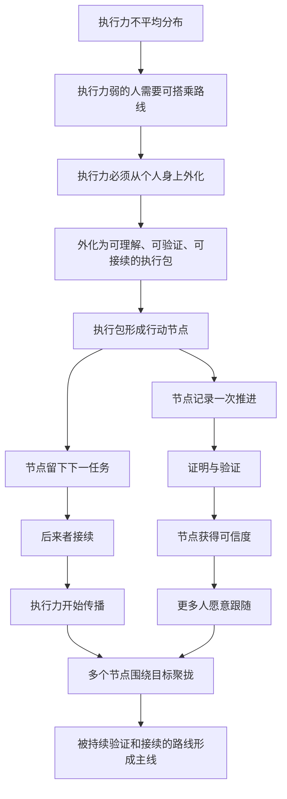

# 执行力逻辑递进

这份文档先不讨论具体功能，也不讨论底层工具实现。

它只梳理本产品当前依赖的核心逻辑：为什么“执行力”可以成为产品对象，它如何被封装、传播、验证、接续，并最终聚拢成更大的执行力。

## 1. 起点：执行力是世界运转的基础

现实世界里，事情不是靠想法自动发生的。

任何目标从 A 点到 B 点，都需要持续的判断、拆解、行动、修正和收束。这种把目标推向结果的能力，可以暂时称为执行力。

执行力并不平均分布。

有的人执行力强：

- 能快速判断下一步
- 能把模糊目标拆成可做任务
- 能在阻力出现时继续推进
- 能留下别人可以理解的结果
- 能判断什么时候应该收束

有的人执行力弱：

- 知道自己想去 B 点，但不知道第一步怎么走
- 容易在规划阶段消耗掉行动能量
- 容易被路线选择拖住
- 容易开始，但难以接续
- 做完一小段后不知道下一段如何展开

因此，在做同一件事时，执行力弱的人常常需要借助执行力强的人。

这不是简单的服从关系，而是一种现实结构：当一个人无法稳定设计路线时，他可以搭乘另一个人已经设计好的路线。

即使那条路线不是绝对最短，也可能比自己停在原地更有效。

## 2. 第一层抽象：执行力不是个人品质，而是可外化的结构

通常我们把执行力看成某个人的性格或能力。

但本产品要依赖的前提是：执行力的一部分可以从人身上外化出来。

一个执行力强的人真正有价值的，不只是他完成了某件事，而是他在完成过程中隐含地做了很多判断：

- 他如何理解目标
- 他如何设定边界
- 他如何决定先后顺序
- 他如何判断结果是否足够
- 他如何把下一步留给后来者

如果这些判断只停留在个人脑中，执行力就很难传播。

如果这些判断被结构化表达出来，执行力就有机会成为别人可以读取、接住、复制和延续的东西。

所以本产品的第一层产品假设是：

> 执行力可以被部分封装为一种可理解、可验证、可接续的结构。

## 3. 第二层抽象：执行力的最小传播单位

如果执行力要传播，就需要一个最小单位。

这个单位不能只是想法，也不能只是结果。

想法没有行动证明，结果又常常缺少过程和下一步。

本产品需要的最小单位应该同时包含三件事：

1. 我接住了什么
2. 我完成了什么
3. 我留下了什么

可以把这个单位称为：

```text
Execution Packet
执行包
```

一个执行包包含：

- 前置状态：我接手时事情处在什么状态
- 接手任务：上一个节点留下了什么要求
- 执行路线：我准备如何完成它
- 完成结果：我实际产出了什么
- 推进证据：为什么别人可以相信这次行动真实发生
- 完成判断：为什么我认为它已经完成
- 下一任务：我留给后来者的下一步是什么
- 接续要求：后来者怎样证明自己完成了下一步

执行包的关键不是“记录我做过”，而是“让别人能接着做”。

## 4. 第三层抽象：节点不是记录，而是接力

如果每个执行包都可以被别人接住，那么它就不只是一个记录点，而是一个接力点。

一个节点同时有两个身份：

- 它是一次真实推进的行动证据
- 它是后一个任务的发起入口

因此，本系统中的节点应该被理解为：

```text
目标 -> 推进节点 -> 证据 -> 智能合约判断 -> 阶段记录或后续节点
```

它不是孤立的成果展示。

它必须回答：

- 我接的是谁留下的任务
- 这次推进发生了什么
- 我用什么证据说明推进结果
- 我留下的下一步是否清楚
- 后面的人是否愿意继续跟

这个结构让执行力可以从一个人转移到另一个人。

真正传播的不是热情，而是可接续性。

需要特别区分：节点记录行动过程，完成记录记录阶段闭合。一次推进可能没有立即完成目标，但它仍然有价值；后续节点可以补足它，某次收束推进经智能合约审查通过并由用户确认后，再生成覆盖一段节点的阶段完成记录。

## 5. 第四层抽象：执行力传播依赖验证

如果任何人都可以声称自己完成了任务，执行力系统会很快失真。

所以本产品不能只依赖表达，还必须依赖验证。

验证不是为了惩罚用户，而是为了让智能合约和后来者判断：

> 这个节点值得我接着走吗？

一个节点至少需要被验证这些方面：

- 任务是否足够清楚
- 结果是否真实存在
- 证明是否支持推进声明
- 推进结果是否对应当前目标
- 下一任务是否接得上当前目标
- 后续执行者能否理解并接续

验证可以来自多种方式：

- 自我说明
- 结果材料
- 前后对比
- 数据变化
- 第三方确认
- 后续节点引用
- 多人采用
- 维护者判断
- 自动格式检查
- 辅助质量分析

本产品不一定一开始就需要强制所有验证都自动化。

但它必须把验证作为产品核心，而不是附加功能。

## 6. 第五层抽象：执行力不是线性增加，而是通过接续放大

单个人的执行力有限。

一个人可以完成一段，但很难无限推进所有事情。

如果每个人都只完成自己的孤立节点，整体执行力仍然是碎片化的。

本产品想要的是另一种结构：

```text
一个人完成一段
↓
留下清楚下一步
↓
另一个人接住
↓
继续完成一段
↓
再留下下一步
```

当这个过程持续发生，执行力就不再只属于某个人，而开始在节点之间流动。

这时执行力会出现放大效应：

- 后来者不必从零理解目标
- 后来者不必从零设计路线
- 后来者可以继承已有判断
- 后来者可以比较不同路线
- 后来者可以把有效部分继续传下去

执行力的传播不是靠命令，而是靠一个节点让下一个节点更容易发生。

## 7. 第六层抽象：主线不是预设的，而是被持续跟随形成的

在复杂目标中，路线不会只有一条。

不同人会用不同方式完成同一任务，也会留下不同的下一步。

因此本产品不应该一开始就假设只有唯一正确路线。

它应该允许多个执行路线并存：

- 有些路线更快
- 有些路线更稳
- 有些路线成本更低
- 有些路线适合少数人
- 有些路线更容易被大众接续

主线不是由系统强行宣布的。

主线应该是被持续验证、持续接续、持续跟随后自然形成的。

也就是说：

> 哪条路线能让更多有效行动继续发生，哪条路线就更接近主线。

主线代表的不是权威，而是当前最值得后来者继承的执行路径。

## 8. 第七层抽象：聚拢执行力的条件

执行力要聚拢，不能只靠很多人一起行动。

很多行动如果互相不接续，反而会变成噪音。

本产品要聚拢执行力，需要满足几个条件：

1. 有共同目标
2. 节点能说明自己接住了什么
3. 节点能证明自己完成了什么
4. 节点能留下别人可接的下一步
5. 后续行动能引用前序节点
6. 有机制判断哪些路线更值得继续
7. 有界面让人看见当前最可接续的位置

执行力的聚拢不是把所有人压成同一条路线。

它更像是让分散行动不断向同一个目标产生有效贡献。

一个好的系统应该让用户知道：

- 现在主线在哪里
- 哪些节点已经被证明有效
- 哪些任务正在等待接续
- 哪些路线虽然分叉但值得关注
- 我现在接哪里最容易产生贡献

## 9. 第八层抽象：平台真正要奖励什么

如果本产品要塑造行为，它必须非常清楚自己奖励什么。

它不应该奖励单纯的活跃。

因为活跃可能只是噪音。

它也不应该奖励单纯的自我宣称。

因为宣称不等于执行。

本产品应该奖励：

- 把任务描述清楚的人
- 把结果证明清楚的人
- 把下一步留下清楚的人
- 让后来者更容易开始的人
- 让路线更容易被验证的人
- 让分散行动汇回目标的人
- 让主线更可执行的人

一个强节点的标准不是“作者看起来很厉害”，而是：

> 这个节点之后，别人更容易继续行动。

一个强执行者的标准也不是“做了很多事”，而是：

> 他的节点被更多有效行动继承。

## 10. 第九层抽象：执行力值不是努力值

如果未来需要衡量执行力，不能把它设计成简单积分。

执行力值不应该等于：

- 发了多少节点
- 花了多少时间
- 写了多少字
- 上传了多少证明

这些都容易被刷，也不一定产生真实推进。

更合理的执行力值应该来自：

- 节点是否被验证
- 节点是否被接续
- 节点是否被多人采用
- 节点是否降低后续执行成本
- 节点是否推进了目标状态
- 节点留下的下一任务是否被完成
- 节点是否汇入更稳定的主线

也就是说，执行力值衡量的不是“我用了多少力”，而是：

> 我的行动让系统产生了多少后续行动能力。

## 11. 第十层抽象：本产品的核心问题

到这里，本产品不再是一个普通任务管理工具。

它的核心问题不是：

```text
用户今天做了什么？
```

而是：

```text
用户的行动能否成为别人继续行动的基础？
```

因此本产品的底层问题可以分成三类。

第一类：节点有效性

- 这个节点接住了什么任务？
- 它是否完成了任务？
- 它的证明是否可信？
- 它的判断是否清楚？

第二类：接续能力

- 它留下了什么下一步？
- 下一步是否可执行？
- 后来者如何判断自己完成了？
- 这个节点是否降低了后来者开始的门槛？

第三类：主线形成

- 哪些节点被持续跟随？
- 哪些路线产生了更多有效后续行动？
- 哪些节点应该被视为当前主线的一部分？
- 哪些分流虽然存在，但不适合让后来者优先接续？

## 12. 当前产品定义

产品模型补充为：

> 节点记录真实推进，智能合约审查一段推进是否达到目标，完成记录锁定被审查覆盖的节点范围。

这意味着“没有立即完成”不等于“没有价值”。未关闭的推进会保留在节点链中，并通过后续节点继续；只有 AI 审查通过且用户确认，才会生成阶段完成记录。

这里进一步明确一个现实前提：

> 拉出一个节点，首先是因为用户付出了一段时间或工作量，而不是因为这件事已经完整完成。

做事时经常会出现这样的情况：在 A 点制定目标后，用户知道必须拆成 B、C 两条路径；C 推进了一次仍不能完成，于是继续拉出 D；D 经过智能合约审查后，证明 C 的预期已经被补足，于是 C、D 被同一条阶段完成记录覆盖。随后用户回到 B，发现 B 还需要新的补充路径，直到某个后续节点 E 通过审查，并把前面相关节点一起收束。

所以本产品中：

- 节点表示真实推进和行动证据
- 分叉表示现实执行中发现了拆解或遗漏
- 后续节点表示对未闭合缺口的继续补足
- 收束节点表示一次普通行动触发了更大范围的完成判定
- 完成记录表示智能合约确认某段推进已经可以锁定

这能解释“合并节点”的矛盾：如果每个节点都是一次行动，合并就不能是纯图结构操作。所谓合并，应该是一项引用多个来源的普通行动。它提交证据、接受智能合约审查，通过后才在完成记录层形成收束。

基于上面的递进逻辑，本产品当前可以这样定义：

> 本产品是一个执行力传播系统。它把人的行动封装成可验证、可接续的执行包，让执行力从个人身上流动出来，在目标周围聚拢成主线。

更短一点：

> 本产品让执行力可以被封装、传播、接续和聚拢。

这一定义暂时不依赖任何具体底层工具。

工具只是承载层，核心是执行力如何成为可传播结构。

## 13. 当前逻辑依赖图

当前本产品的思考顺序应该是：



这张图里的依赖关系很重要。

如果没有验证，节点不能让后来者信任。

如果没有下一任务，节点不能传播执行力。

如果没有接续，节点只是孤立成果。

如果没有主线，分散执行力不能聚拢。

所以本产品不能从“页面有什么功能”开始设计。

它应该先从下面这个链条开始：

```text
目标 -> 执行包 -> 节点 -> 验证 -> 接续 -> 跟随 -> 主线
```

## 14. 后续需要继续澄清的问题

这份文档只是把逻辑链先立起来。

后面还需要继续回答：

- 一个执行包的最小格式是什么？
- 哪些证明类型适合不同目标？
- 谁有资格验证节点？
- 主线是自动形成、人工确认，还是两者结合？
- 节点被多人跟随时如何计算权重？
- 如何避免刷节点、伪造证明和无效活跃？
- 如何让执行力弱的人更容易接住任务？
- 如何让执行力强的人愿意留下可继承路线？
- 如何让平台既允许分流，又能聚拢主线？

这些问题回答清楚以后，才适合继续进入功能设计。
